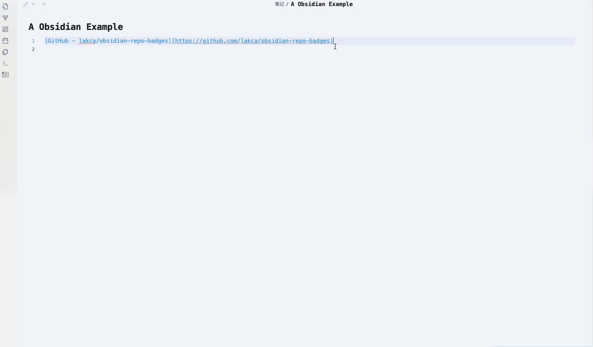

# Obsidian GitHub/GitLab Badges Plugin

This Obsidian plugin appends badges to GitHub and GitLab repository URLs in your current markdown file. The badges include information such as stars, the latest release version, and the top programming language used in the repository.

## Features

- Automatically finds repository URLs in the current markdown file and appends badges.
- Allows users to add badges at the current cursor position.
- Customizable badge options based on repository author and name.
- Enable/disable existing badges through settings.

## Badges

The following badges are default:

- **Stars**: Displays the number of stars the repository has received.
- **Latest Release Version**: Shows the most recent release version of the repository.
- **Top Language**: Indicates the primary programming language used in the repository.

## Commands

- **Add Badges in Current File**: Scans the current markdown file for repository URLs and appends the corresponding badges.
- **Add Badges**: Inserts badges at the current cursor position, detecting the URL at that position.

## Settings

The plugin provides customizable settings, including:

- Badge templates with placeholders `{author}` and `{name}` for dynamic badge generation.
- Toggle to set inline block badges.

## Installation

1. Download or clone the repository.
2. Place the plugin folder in your Obsidian plugins directory.
3. Enable the plugin in the Obsidian settings.

## Usage

- Open a markdown file containing GitHub or GitLab repository URLs.
- Use the command palette to execute "Add Badges in Current File" or "Add Badges" to insert badges.
- Customize badge settings through the plugin options in the settings menu.

## Contributing

Contributions are welcome! Please feel free to submit a pull request or open an issue for any suggestions or improvements.

## License

This project is licensed under the MIT License. See the LICENSE file for details.
